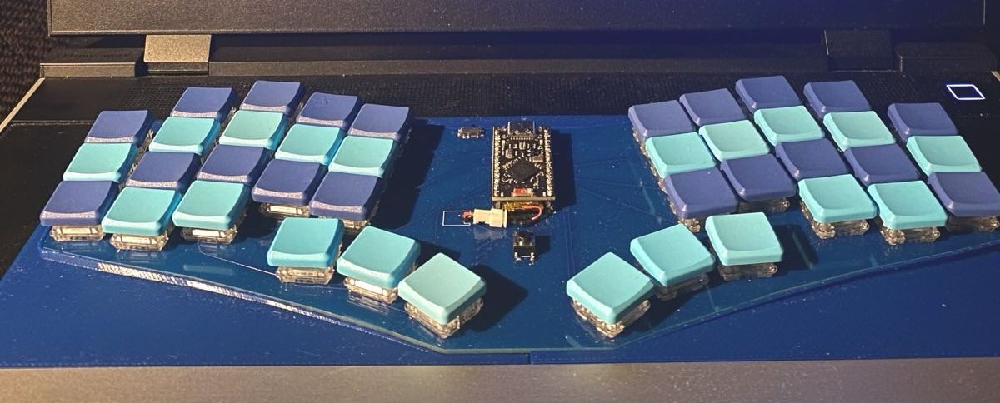
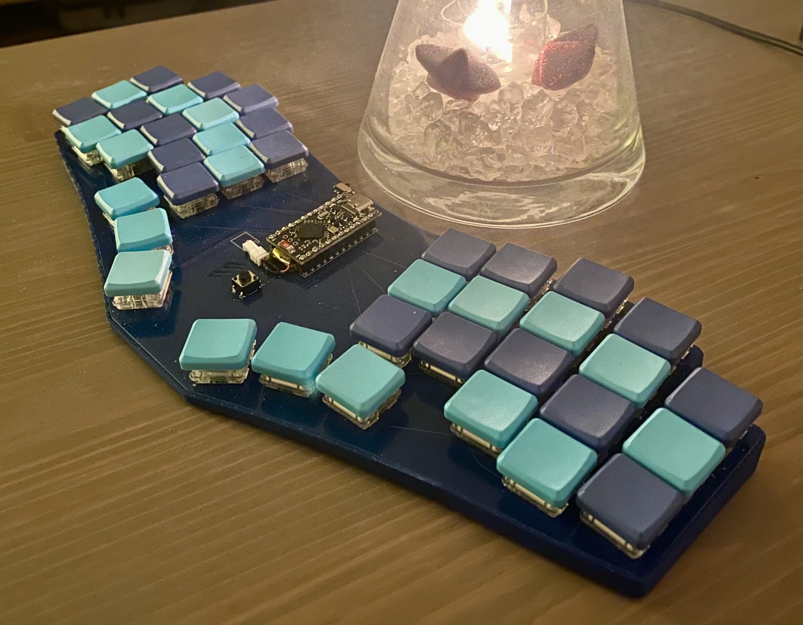

# Framework 16 Keyboard v1

Here's an ortholinear split keyboard that fits in your Framework 16 instead of the default keyboard.

It's using Kaihl Choc switches and the case has an angle of 5 degrees so it will not allow you to close the laptop while using it.

## ZMK and QMK

There some settings for zmk and qmk to get you started with the correct pin layout.

Any Pro Micro compatible controller should work. The nice!nano v2 is used in the image, and I have also connected an RP2040 without any problems. 

## 3D Print Files
- Left and Right are for the laptop. They should have a tight fit without having to squeeze them in between the other components. 
- Bottom is for your desk so you can choose to put the pcb on your desk as well. 
- Top is for travel protection. It fits on top of the Bottom case with the keyboard inside.

## ⚠️ Disclaimer

These PCB files are provided **as-is**, without any warranty or guarantee of functionality or safety. Use them at your own risk. I am not responsible for any damage, injury, or loss resulting from the use of these files.
